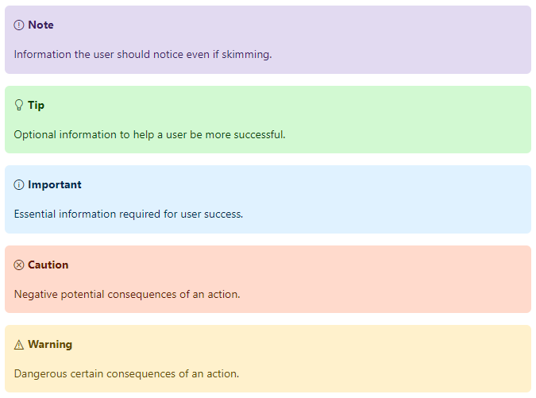

# Microsoft Edge Developer documentation


<!-- ====================================================================== -->
## Microsoft Open Source Code of Conduct

For more information about the Microsoft Open Source Code of Conduct, navigate to [Microsoft Open Source Code of Conduct](CODE_OF_CONDUCT.md).


<!-- ====================================================================== -->
## Legal Notices

Microsoft and any contributors grant you a license to the Microsoft documentation and other content in this repository under the [Creative Commons Attribution 4.0 International Public License](https://creativecommons.org/licenses/by/4.0/legalcode), navigate to the [LICENSE](./LICENSE) file, and grant you a license to any code in the repository under the [MIT License](https://opensource.org/licenses/MIT), navigate to the
[LICENSE-CODE](./LICENSE-CODE) file.

Microsoft, Windows, Microsoft Azure and/or other Microsoft products and services referenced in the documentation may be either trademarks or registered trademarks of Microsoft in the United States and/or other countries.
The licenses for this project do not grant you rights to use any Microsoft names, logos, or trademarks.
Microsoft general trademark guidelines may be found at [https://go.microsoft.com/fwlink/?LinkID=254653](https://go.microsoft.com/fwlink/?LinkID=254653).

Privacy information can be found at [https://privacy.microsoft.com](https://privacy.microsoft.com).

Microsoft and any contributors reserve all others rights, whether under their respective copyrights, patents, or trademarks, whether by implication, estoppel or otherwise.

<!-- ====================================================================== -->
## Contributing

This repo, `edge-developer`, is the repository for the source Markdown files for the Microsoft Edge Developer documentation.  The resulting rendered documentation is hosted at [https://docs.microsoft.com/microsoft-edge](https://docs.microsoft.com/microsoft-edge/index).  This repo also includes the hub page for the Microsoft Edge Enterprise documentation and the Microsoft Edge Developer documentation.  The source files for the Microsoft Edge Enterprise documentation are not in this repo, but are in the [Edge-Enterprise](https://github.com/MicrosoftDocs/Edge-Enterprise) repo.

If you want to include new coverage or have feedback, consider [contributing](./CONTRIBUTING.md).  You can edit the existing content, add new content, or create new [issues](https://github.com/MicrosoftDocs/edge-developer/issues).  The Microsoft Edge team reviews a look at your suggestions and works to incorporate the suggestions into the docs.

Find the data for the [Status](https://developer.microsoft.com/microsoft-edge/status) webpage at:  [https://github.com/MicrosoftEdge/Status](https://github.com/MicrosoftEdge/Status).  The `Status` webpage provides the latest implementation status and future plans for web platform features in Microsoft Edge.

### Conventions

*   When adding a webpage, you must add an entry for it in [toc.md](./microsoft-edge/toc.yml) for it to appear.
*   A directory may contain more directories or `readme.md` files.
*   Folder/directory names are dash-separated (for example, `f12-tools`) and lowercase.  Directories are used in URLs on the `docs.microsoft.com` site.  Avoid using underscores, PascalCase, or camelCase.

### Other text elements

These other text elements have styling available:

*   Unordered lists
*   Have regular bullets
    *   You can also nest bullets.
    *   Bullets lists should have more than one entry.
*   Standard arrangement

1.  Ordered lists.
1.  Use regular western-style numbering.
1.  Should be used only when a list truly has order.

---

Horizontal rules are available.  Use horizontal rules sparingly to reduce clutter.
Avoid using horizontal rules with heading tags; some headings already use line styles for visual hierarchy.

### Displaying code

You can use inline `code` markdown syntax (with the backticks).

Or you can display blocks of code.  The following code snippet is a CSS example.

```css
body {
    background: #fff;
}
```

### Tables

| You can | use column headings | on tables |
|:--- |:--- |:--- |
| Left-aligned | Unless a # | 456 |
| Text value | More text | $0.00 |

### Notes

Use notes sparingly.  The blocks are designed to highlight "don't-miss-it" information.

Four different versions of notes are currently styled.

*   NOTE
*   WARNING
*   TIP
*   IMPORTANT

The tagging is as follows:

```md
> [!NOTE]
> This is a NOTE
```

```md
> [!WARNING]
> This is a WARNING
```

```md
> [!TIP]
> This is a TIP
```

```md
> [!IMPORTANT]
> This is IMPORTANT
```



For multi-line blockquote notes, use a greater-than \(`>`\) character in front of each line of the notes as displayed in the following example.

```md
> This is a line in a blockquote.
> My text might wrap to more than one line when the markdown is parsed, but you can use a single long line in the markdown.
> This is another line in a blockquote.
```

### Images

Images should be stored in a `media` directory and referenced with a relative path using the following triple-colon image markup:

<!--  ``  -->

```md
:::image type="complex" source="./media/notes.png" alt-text="Note patterns" lightbox="./media/notes.png":::
   Note patterns
:::image-end:::
```
